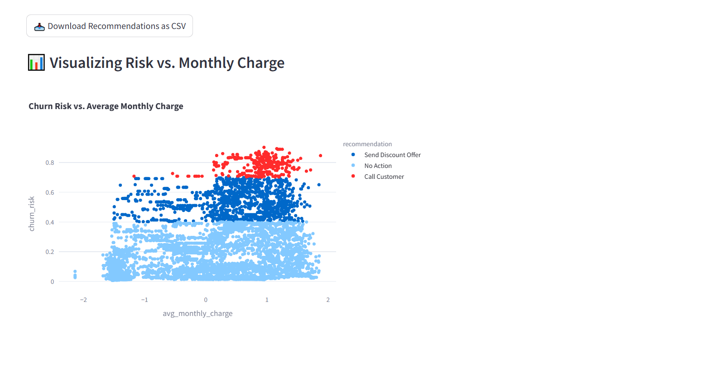

# 📊 SaaS Customer Churn Prediction

This project is a complete, production-ready example of a **Customer Churn Prediction System** for a SaaS company. It includes data preprocessing, model training, churn risk scoring, and personalized action recommendations—all with a clean Streamlit dashboard.

---

## 🚀 Features
- Gradient Boosting model for churn prediction
- Feature engineering with encoding and scaling
- Personalized recommendations based on churn risk:
  - Call Customer
  - Send Discount Offer
  - No Action
- Streamlit dashboard for real-time interaction
- Modular and readable codebase

---

## 📁 Project Structure
```
churn_prediction_saas/
├── data/
│   └── saas_data.csv              # Input data (from Kaggle Telco Churn)
├── src/
│   ├── data_loader.py            # Load and return data as DataFrame
│   ├── feature_engineering.py    # Preprocessing pipeline
│   ├── model.py                  # Training and evaluation logic
│   ├── recommender.py            # Churn risk scoring + recommendations
│   └── dashboard.py              # Streamlit app
├── main.py                       # CLI training/testing entry point
├── requirements.txt              # Required packages
├── dashboard_screenshot.png      # Dashboard screenshot (optional)
└── README.md                     # Project description
```

---

## 📦 Installation
```bash
git clone https://github.com/aviramcohen1/churn_prediction_saas.git
cd churn_prediction_saas
pip install -r requirements.txt
```

---

## 📈 Run Model Training
```bash
python main.py
```

---

## 📊 Launch Dashboard
```bash
streamlit run src/dashboard.py
```

Then open the link (usually http://localhost:8501/) and upload your `saas_data.csv` file.

---

## 🖼 Screenshot
Below is a screenshot of the interactive dashboard:



---

## 📄 Sample Data Source
- Kaggle: [Telco Customer Churn Dataset](https://www.kaggle.com/datasets/blastchar/telco-customer-churn)
- Rename it to `saas_data.csv` and place inside `data/` folder.

---

## 💡 Possible Extensions
- Add more features (e.g. total charges, internet service type)
- Try deep learning or ensemble stacking
- Deploy via Docker or on cloud platforms

---

Made with ❤️ by Aviram

